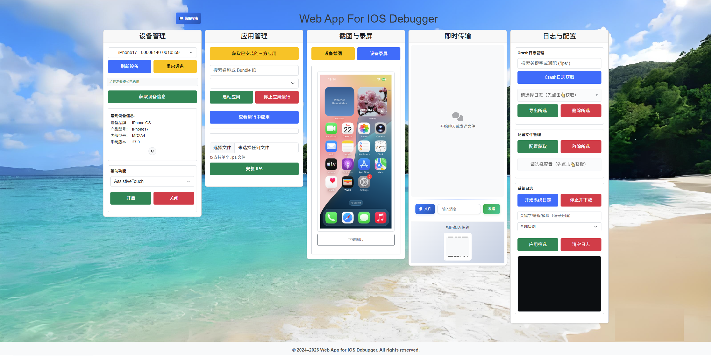

<div align="center">


# WebAppForIOS

**Web console for iOS device testing and debugging**

[](https://python.org)
[](https://flask.palletsprojects.com/)
[](https://github.com/danielpaulus/go-ios)

[中文](README.md) · [English](README_en.md)

**[Developer image](docs/developer-image_en.md)** · **[User guide](web_function/templates/ios_introduce_guide_index.html)**

</div>

WebAppForIOS is for engineers who operate a USB-attached iPhone or iPad from the browser. It runs on Windows, Linux, and macOS. On the page you can read device info, manage apps, take screenshots and recordings, and collect syslog and crash logs.

Any browser on the same LAN can open the console. After startup, use `http://<lan-ip>:5001`. **使用指南** in the header opens `/guide`.



---

## Highlights

* **Browser console** — Connect, refresh, and run day-to-day actions in the page. No Xcode install and no extra desktop client.
* **Main device-debug path in one place** — Device info, app install and start/stop, screenshots, recording, syslog, crash logs, and configuration profiles.
* **iOS 17 and later** — Windows uses an userspace tunnel and wintun. Images mount only when `ApChipID` and `ApBoardID` match, which keeps an older image from failing with `findIdentity`.
* **LAN instant transfer** — Send text and files in the page, and show a QR code so a phone on the same network can open the console.
* **Identity-based images** — Reuse a local match. When none exists, fetch the current personalized image from [DeveloperDiskImage](https://github.com/doronz88/DeveloperDiskImage) `main`, and download payloads only after the manifest contains this device.

---

## Get started

**Requirements:** Python 3.10+ · Windows 10 / macOS / Linux · USB device with Developer Mode on and trust granted.

### 1. Install

```powershell
# Windows
py -3.12 -m venv .venv
.\.venv\Scripts\python.exe -m pip install -U pip
.\.venv\Scripts\python.exe -m pip install -r requirements.txt
```

```bash
# Linux / macOS
python3.12 -m venv .venv
./.venv/bin/python -m pip install -U pip
./.venv/bin/python -m pip install -r requirements.txt
```

Optional fallback for chip identity and auto-mount: `pip install "pymobiledevice3>=4.0.0"`. See the [developer image](docs/developer-image_en.md) note.

### 2. Start the console

```powershell
# Windows
.\.venv\Scripts\python.exe web_function\app.py
```

```bash
# Linux / macOS
./.venv/bin/python web_function/app.py
```

The server listens on the machine LAN address, port **5001**, and tries to open a browser. Health check: `GET /health`. Logs: `runtime/logs/ios_app.log` (`runtime/` is created on first run).

### 3. Attach a device and use the page

1. Enable Developer Mode (Settings → Privacy & Security → Developer Mode) and trust this computer.
2. Connect USB, click **刷新设备** (Refresh), and select the device in the list.
3. Use the page sections: device info, apps, screenshot or recording, logs, or instant transfer.
4. Open **使用指南** in the header (`/guide`) when a control is unclear.

Offline check for image matching:

```bash
python -m unittest tests.test_ddi_manager
```

---

## Coverage

| Area | Capability | Notes |
|:-----|:-----------|:------|
| Device | List, details, reboot, Developer Mode | Details include battery and disk; assistive features cover AssistiveTouch, VoiceOver, Zoom |
| Apps | Installed list, running processes, launch / stop, IPA install | Search by name or bundle id |
| Screen | Still screenshot, MJPEG recording | Screenshots go to `runtime/uploads/screenshots/`, recordings to `runtime/uploads/recordings/` |
| Logs | Live syslog, crash `.ips` | Filter syslog by keyword and level; export or delete crash logs |
| Profiles | List and remove configuration profiles | go-ios `profile` |
| Transfer | Text, files, QR code | WebSocket; upload cap comes from runtime config (default 512MB) |
| Link | Tunnel, personalized developer image, port forward | iOS 17+ needs a tunnel and a matching developer image |

---

## Key capabilities

**Device and apps** — Refresh attached devices, read model, OS version, battery, and disk, toggle assistive features, install an IPA, and launch or stop apps.

**Screenshot and recording** — A still screenshot uses the quick check. Recording starts an MJPEG stream after the tunnel is ready and saves an MP4 on the server.

**Logs and profiles** — Syslog can be filtered and downloaded. Crash logs support wildcard search, export, and delete. Configuration profiles can be listed and removed.

**Instant transfer** — Send text and files from the console. The QR code points at this machine so a phone on the same network can open the page and transfer files.

**Developer image** — On iOS 17+, mounting follows chip identity in `Restore/BuildManifest.plist`. The server prefers `runtime/devimages` and can fetch the current personalized image from GitHub when nothing matches. Steps and diagnostics: [docs/developer-image_en.md](docs/developer-image_en.md).

---

## Layout

```
web_function/           Web entry, templates, static assets (app.py, port 5001)
backend_function/       go-ios wrapper, tunnel, developer image, API handlers
IOSPrechecker/
  utils/                go-ios archives (committed)
  wintun/               Windows tunnel driver (committed)
  executable/           Unpacked at runtime (not committed)
  devimages/            Local image folder (not committed)
runtime/                Logs, uploads, downloaded images (not committed)
tests/                  Developer-image matching tests
docs/                   Developer-image notes
```

Routes live in `web_function/app.py`. Handlers are `backend_function/route_handlers.py` and `api_handlers.py`.

---

## Documentation

| Doc | Audience | Notes |
|:----|:---------|:------|
| This file | New users | Install, start, and coverage |
| [docs/developer-image_en.md](docs/developer-image_en.md) | Troubleshooting | Image paths, mount order, diagnostics |
| Console user guide | While operating | Open `/guide` after startup |
| [README.md](README.md) | 中文 | Chinese readme |

---

## FAQ

**No device in the list** — Check the cable and that the device trusts this computer, then refresh. Service logs are in `runtime/logs/ios_app.log`.

**Developer Mode check or recording returns 500** — The tunnel or developer image is usually not ready. Read `ApChipId` / `ApBoardId` in the log and see the [developer image note](docs/developer-image_en.md).

**Tunnel will not start** — On Windows, `IOSPrechecker/wintun` from the repo must be present. If the log says port `60105` is in use, stop leftover `ios.exe` processes and start again.

**Screenshot works, recording does not** — A still screenshot can succeed before an image is mounted. Recording runs the full check: tunnel, a matching developer image, and Developer Mode on the device.

---

Use this tool for development and test debugging. Follow local law and the Apple developer agreement.
